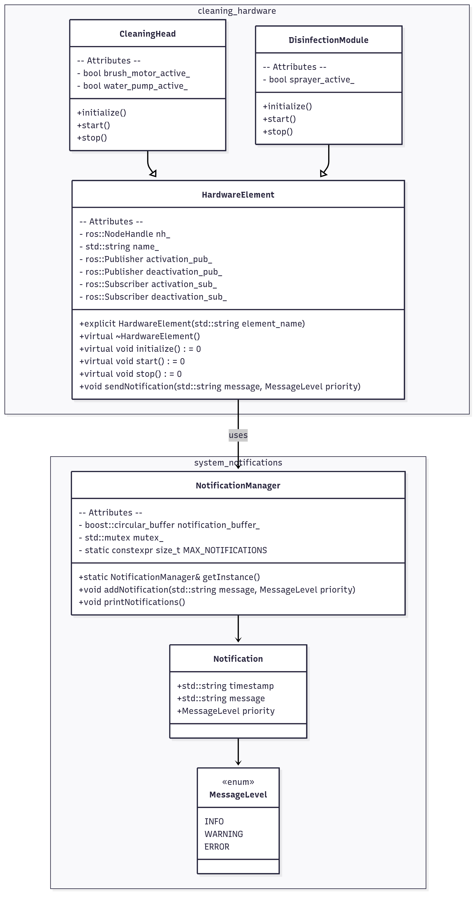

# InterTalk

## Project Overview

This project is a simplified representation of how notification management for multiple cleaning hardware elements was handled in the cleaning robot at Avidbots.

The system models two primary hardware elements:
- A **Disinfection Module** (sprayer)
- A **Cleaning Head** (with brush motor and water pump)

Each element is implemented as a Robot Operating System (ROS) node, activated and deactivated through commands from a higher-level hardware element controller. These nodes listen for specific ROS messages issued by the controller to perform their activation and deactivation procedures.

The project also implements a **singleton NotificationManager**, responsible for saving and printing recent notifications generated by any of the hardware elements. In the real-world application, these messages would be published to an external fleet management system, allowing operators to monitor robot activity and diagnose issues remotely.

## Architecture

The overall architecture of this class implementation is summarized below:

## Additional Resources

A complementary public presentation is also attached to provide further context on the real-world system and project that I worked on.
